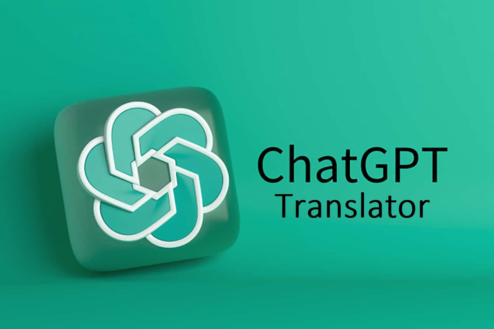

# JR-TG-Bot-on-aiogram3

## Описание проекта

Данный проект представляет собой Телеграм-бота, который предоставляет пользователям различные функции, связанные с обработкой текстов и взаимодействием с AI. Бот способен генерировать случайные факты, вести диалоги с известными личностями, проводить квизы на различные темы, переводить текст и давать рекомендации по медиа-контенту.

---

## Функционал бота

### 1. *"Случайный факт"*


- Бот обрабатывает команду `/random`.
- При обработке команды отправляет заранее заготовленное изображение.
- Делает запрос к ChatGPT с заранее заготовленным промптом.
- Полученный ответ передается пользователю.
- К сообщению прикрепляются две кнопки:
  - **"Закончить"**: работает так же, как команда `/start`.
  - **"Хочу ещё факт"**: работает так же, как команда `/random`.

### 2. *"ChatGPT интерфейс"*


- Бот обрабатывает команду `/gpt`.
- При обработке команды отправляет заранее заготовленное изображение.
- Переходит в режим ожидания текстового сообщения от пользователя.
- Делает запрос к ChatGPT с текстом полученного сообщения.
- Ответ ChatGPT передается пользователю в текстовом сообщении.
- Пользователь может продолжать диалог или вернуться в главное меню.

### 3. *"Диалог с известной личностью"*


- Бот обрабатывает команду `/talk`.
- При обработке команды отправляет заранее заготовленное изображение.
- Предлагает выбор из нескольких известных личностей с помощью кнопок.
- По нажатию кнопки устанавливается промпт выбранной личности.
- Дальнейшие текстовые сообщения от пользователя передаются ChatGPT, а его ответы возвращаются пользователю.
- К ответам прикрепляется кнопка **"Попрощаться!"**, которая работает так же, как команда `/start`.

### 4. *"Викторина"*


- Бот обрабатывает команду `/quiz`.
- При обработке команды отправляет заранее заготовленное изображение.
- Предлагает выбор из нескольких тем с помощью кнопок.
- После выбора темы передает запрос ChatGPT и получает вопрос викторины.
- Пользователь отвечает на вопрос, и его ответ передается ChatGPT для получения результата.
- Результат отправляется пользователю с возможностью:
  - Задать ещё вопрос на ту же тему.
  - Сменить тему.
  - Закончить викторину.
- Бот ведет счёт вопросов и правильных ответов, и отображает их вместе с результатами.

### 5. *"Перевод текста"*


- Бот обрабатывает команду `/translator`.
- При обработке команды отправляет заранее заготовленное изображение.
- Предлагает выбор из нескольких направлений для перевода с помощью кнопок.
- После выбора направления переходит в режим ожидания текста для перевода.
- Передает запрос ChatGPT и получает готовый перевод.
- Результат отправляется пользователю с возможностью:
  - Перевести ещё один текст.
  - Закончить.

### 6. *"Рекомендации по фильмам, книгам и музыке"*


- Бот обрабатывает команду `/media`.
- При обработке команды отправляет заранее заготовленное изображение.
- Предлагает выбор из нескольких категорий медиа (фильмы, книги, музыка) с помощью кнопок.
- После выбора категории предлагает выбор из нескольких жанров с помощью кнопок.
- После выбора категории и жанра передает запрос ChatGPT и получает рекомендацию.
- Результат отправляется пользователю с возможностью:
  - Получить другую рекомендацию в том же жанре.
  - Выбрать другой жанр.
  - Закончить.

---

## Архитектура проекта

### Структура папок:
```
├── main.py                 # Главный модуль приложения
├── config.py              # Конфигурация приложения
├── exception.py           # Пользовательские исключения
├── utils.py               # Вспомогательные функции
├── requirements.txt       # Зависимости проекта
├── README.md             # Документация проекта
├── common/               # Общие компоненты приложения
│   ├── __init__.py       # Экспорты пакета
│   ├── constants.py      # Константы приложения
│   ├── enums.py          # Перечисления и типы данных
│   └── assets.py         # Работа с ресурсами (изображения, тексты)
├── models/               # Модели данных и бизнес-логика
│   ├── __init__.py       # Экспорты пакета
│   ├── chat_gpt.py       # Интеграция с ChatGPT API
│   ├── buttons.py        # Модели кнопок
│   └── callback_data.py  # Модели callback данных
├── handlers/             # Обработчики сообщений и состояний
│   ├── __init__.py       # Экспорты пакета
│   ├── message_handler.py    # Обработчики текстовых сообщений
│   ├── callback_handlers.py  # Обработчики callback запросов
│   └── state_handlers.py     # Определения состояний FSM
├── commands/             # Команды бота
│   ├── __init__.py       # Экспорты пакета
│   └── commands.py       # Обработчики команд (/start, /random, etc.)
├── keyboards/            # Клавиатуры и кнопки
│   ├── __init__.py       # Экспорты пакета
│   ├── keyboards.py      # Обычные клавиатуры
│   └── inline_keyboards.py # Inline клавиатуры
└── resources/            # Ресурсы приложения
    ├── images/           # Изображения для команд
    ├── messages/         # Текстовые файлы с описаниями
    └── prompts/          # Промпты для ChatGPT API
```

### Основные технологии:
- **aiogram 3.20.0** - современный фреймворк для создания Telegram ботов
- **OpenAI API** - интеграция с ChatGPT для генерации контента
- **httpx** - HTTP клиент для работы с API
- **pydantic** - валидация данных и конфигурации
- **FSM (Finite State Machine)** - управление состояниями пользователя

---

## Установка и запуск

### 1. Клонирование репозитория
```bash
git clone <ссылка на репозиторий>
cd TelegramBot-ChatGpt
```

### 2. Создание виртуального окружения
```bash
python -m venv .venv
```

### 3. Активация виртуального окружения
**Windows:**
```bash
.venv\Scripts\activate
```

**Linux/MacOS:**
```bash
source .venv/bin/activate
```

### 4. Установка зависимостей
```bash
pip install -r requirements.txt
```

### 5. Настройка переменных окружения
Создайте файл `.env` в корне проекта со следующими переменными:
```env
# Токен вашего Telegram бота (получите у @BotFather)
BOT_TOKEN=your_telegram_bot_token_here

# API ключ OpenAI (получите на https://platform.openai.com/)
GPT_TOKEN=your_openai_api_key_here

# Адрес прокси-сервера (опционально)
PROXY=http://your_proxy_server:port
```

### 6. Запуск бота
```bash
python main.py
```

---

## Использование

После запуска бота пользователи могут использовать следующие команды:

- `/start` - Главное меню бота
- `/random` - Получить случайный факт
- `/gpt` - Начать диалог с ChatGPT
- `/talk` - Диалог с известной личностью
- `/quiz` - Запустить викторину
- `/translator` - Переводчик текста
- `/media` - Рекомендации по медиа-контенту

---

## Особенности реализации

### Безопасность:
- Все токены хранятся в переменных окружения
- Поддержка прокси для обхода блокировок
- Валидация входных данных

### Производительность:
- Асинхронная обработка запросов
- Кэширование ресурсов
- Оптимизированные запросы к API

### Надежность:
- Обработка ошибок на всех уровнях
- Логирование всех операций
- Graceful shutdown при завершении

### Расширяемость:
- Модульная архитектура
- Четкое разделение ответственности
- Легкое добавление новых функций

---